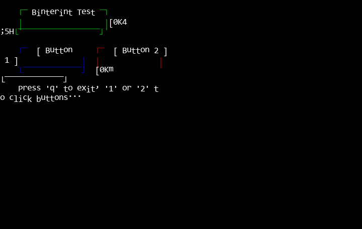

# 🚀 binterint: Cross-Platform Headless TUI Automation

**binterint** (Binary Terminal Interaction) is a powerful, OS-independent utility designed to interact with and automate Terminal User Interfaces (TUIs) headlessly. It virtualizes a terminal environment, allowing you to spawn processes, interact with them programmatically, and capture high-fidelity semantic screenshots for AI-driven automation.

---

## ✨ Key Features

- **🤖 Autonomous Navigation**: New `auto` command that uses rule-based semantic analysis to navigate TUIs toward a goal without external APIs.
- **🌐 OS-Independent PTY**: Seamlessly handles Pseudo-Terminals on both Windows (`pywinpty`) and Unix/macOS (`ptyprocess`).
- **🛡️ Unicode Stability**: Automatic `PYTHONUTF8` injection ensures TUI stability and prevents encoding crashes on Windows.
- **📸 Headless Rendering**: Custom PILLOW-based renderer that converts terminal buffer state to high-quality PNGs with **Roboto Mono** bundling.
- **🧠 Hybrid Semantic Analysis**: Combines fast local heuristics for hotkeys with optional **Gemini/OpenAI** Vision for complex spatial reasoning.
- **🛠️ Developer First**: Pydantic-powered data validation and a clean CLI/Python API.

---

## 🚀 Installation

Install directly from source:

```bash
git clone https://github.com/djmahe4/binterint.git
cd binterint
pip install .
```

OR

```bash
pip install binterint
```

---

## 📖 Usage

### CLI Quickstart

Run a TUI application headlessly and take a screenshot after it settles:

```bash
binterint run "python sample_tui.py" --output screenshot.png --wait 2.0
```

### 🤖 Autonomous Mode

Let `binterint` intelligently navigate the TUI to achieve a goal using rules and pattern matching:

```bash
binterint auto "python sample_tui.py" --goal "Click button 1 and exit"
```

### Interactive Mode

Explore a TUI session and inspect semantic elements:

```bash
binterint interact "htop"
```

### LLM Setup

To enable AI-based semantic analysis, add your API keys to a `.env` file in your project root:

```env
GOOGLE_API_KEY=your_gemini_key
OPENAI_API_KEY=your_openai_key
```

### Python API with AI Analysis

```python
import asyncio
from binterint.controller import TUIController
from binterint.semantic import SemanticAnalyzer

async def main():
    ctrl = TUIController(cols=80, rows=24)
    analyzer = SemanticAnalyzer()

    # Spawn and wait
    ctrl.spawn(["python", "sample_tui.py"])
    ctrl.sync(1.0)

    # Capture screenshot
    img_path = "state.png"
    ctrl.take_screenshot(img_path)

    # Use AI to find elements
    elements = await analyzer.analyze_screenshot(img_path)
    
    for el in elements:
        # Map normalized coords to terminal grid
        grid = analyzer.map_to_grid(el.x, el.y, 80, 24)
        print(f"Found {el.type} '{el.label}' at Col {grid['col']}, Row {grid['row']}")

    ctrl.stop()

if __name__ == "__main__":
    asyncio.run(main())
```

---

## 🎨 Visuals

The headless renderer ensures that even in non-GUI environments, your TUI screenshots look premium and consistent:

 from source [sample_tui.py](sample_tui.py)

---

## 🛠️ Project Structure

- `binterint/`: The core Python package.
  - `pty_engine.py`: Multi-platform PTY abstraction.
  - `renderer.py`: PILLOW-based terminal renderer.
  - `semantic.py`: AI-driven element detection and coordinate mapping.
- `tests/`: Comprehensive test suite including LLM capability mocking.
- `sample_tui.py`: A cross-platform ANSI-based TUI for testing.

---

## ⚖️ License

MIT License. See `LICENSE` for details.